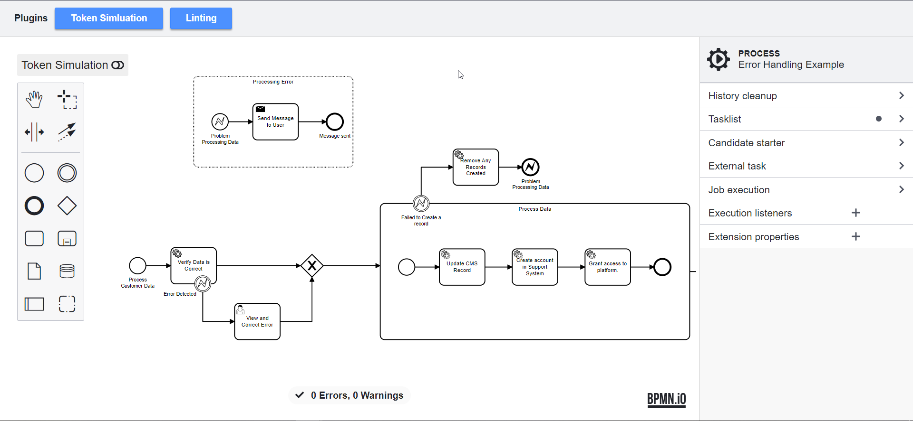

# Plugin Manager Playground 🎮



# Setup

```
npm i
```

Link the following branches locally:

1. https://github.com/bpmn-io/bpmn-js-token-simulation/tree/plugin-manager
2. https://github.com/bpmn-io/bpmn-js-bpmnlint/tree/plugin-manager

```
npm link bpmn-js-token-simulation
npm link bpmn-js-bpmnlint
```

```
npm start
```

# License

MIT